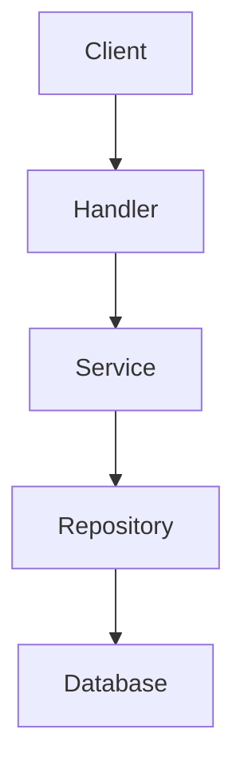

# Claude AI Assistant - Project Rules & Guidelines

## 📁 Documentation Structure

**IMPORTANT:** All documentation MUST be placed in the `docs/` directory with the following structure:

```
docs/
├── README.md                  # Documentation index and navigation
├── architecture/              # System architecture & design docs
│   ├── overview.md           # High-level architecture
│   ├── clean-architecture.md # Clean architecture patterns
│   └── database-schema.md    # Database design
├── api/                      # API documentation
│   ├── endpoints.md          # API endpoints reference
│   ├── request-response.md   # Request/Response examples
│   └── authentication.md     # Auth documentation
├── guides/                   # How-to guides & tutorials
│   ├── getting-started.md    # Setup & installation
│   ├── development.md        # Development workflow
│   ├── testing.md           # Testing guidelines
│   └── deployment.md        # Deployment instructions
├── coverage/                 # Test coverage documentation
│   ├── CI_CD_COVERAGE.md    # CI/CD coverage config
│   └── *.txt                # Coverage reports
└── plans/                    # Implementation plans & RFCs
    └── YYYY-MM-DD-*.md      # Date-prefixed plan documents
```

## 📝 Documentation Rules

### 1. File Placement

**NEVER create documentation files in the root directory.**

✅ **CORRECT:**
- `docs/guides/setup.md`
- `docs/architecture/database.md`
- `docs/api/products-api.md`

❌ **INCORRECT:**
- `SETUP.md` (root level)
- `DATABASE_DESIGN.md` (root level)
- `API_DOCS.md` (root level)

### 2. Documentation Categories

| Category | Location | Purpose |
|----------|----------|---------|
| Architecture | `docs/architecture/` | System design, patterns, diagrams |
| API Docs | `docs/api/` | Endpoints, request/response specs |
| Guides | `docs/guides/` | How-to, tutorials, workflows |
| Coverage | `docs/coverage/` | Test coverage reports & config |
| Plans | `docs/plans/` | Implementation plans, RFCs |

### 3. Naming Conventions

- Use **lowercase** with **hyphens** for file names
- Use **descriptive names**: `getting-started.md` not `start.md`
- Date prefix for plans: `2024-02-01-feature-name.md`
- Use `.md` extension for all documentation

### 4. File Templates

#### Architecture Document
```markdown
# [Component Name] Architecture

## Overview
Brief description of the component/system.

## Design Decisions
Key architectural choices and rationale.

## Components
Detailed component breakdown.

## Data Flow
How data flows through the system.

## Dependencies
External dependencies and integrations.
```

#### API Documentation
```markdown
# [Feature] API

## Endpoints

### GET /api/resource
Description of endpoint.

**Request:**
```json
{
  "field": "value"
}
```

**Response:**
```json
{
  "data": {}
}
```

**Status Codes:**
- 200: Success
- 400: Bad Request
- 404: Not Found
```

#### Guide/Tutorial
```markdown
# [Task] Guide

## Prerequisites
What you need before starting.

## Steps

### Step 1: [Action]
Detailed instructions.

### Step 2: [Action]
Detailed instructions.

## Troubleshooting
Common issues and solutions.

## Next Steps
What to do after completing this guide.
```

## 🛠️ Code Documentation Rules

### 1. Code Comments

- Write comments for **complex business logic**
- Use **GoDoc style** for public functions
- Avoid obvious comments

✅ **GOOD:**
```go
// CalculateTax computes the tax amount based on the product price
// and the applicable tax rate for the given region.
// Returns error if the tax rate is not found for the region.
func CalculateTax(price float64, region string) (float64, error) {
    // Implementation
}
```

❌ **BAD:**
```go
// This function adds two numbers
func Add(a, b int) int {
    return a + b // return the sum
}
```

### 2. README Files

- Each major package should have a `README.md` in `docs/`
- Root `README.md` should reference `docs/README.md`

### 3. Inline Documentation

- Document **why**, not **what**
- Explain business rules and edge cases
- Reference external resources when applicable

## 🧪 Testing Documentation

### Test Coverage Reports

- Place in `docs/coverage/`
- Update after significant test additions
- Include summary and improvement plans

### Test Guidelines

- Document in `docs/guides/testing.md`
- Include examples of:
  - Unit tests
  - Integration tests
  - Mock usage
  - Table-driven tests

## 🚀 CI/CD Documentation

### Pipeline Configuration

- Document in `docs/guides/deployment.md`
- Include:
  - Pipeline stages
  - Environment variables
  - Deployment process
  - Rollback procedures

### Coverage Thresholds

- Documented in `docs/coverage/CI_CD_COVERAGE.md`
- Update when changing `.testcoverage.yml`

## 📊 Diagrams & Visual Docs

### Tools
- Use **Mermaid** for diagrams (renders in GitHub)
- PlantUML for complex architecture diagrams
- ASCII art for simple flows

### Example
```markdown
## Architecture Diagram


\```
```

## 🔄 Documentation Maintenance

### When to Update Docs

- **After feature implementation** - Update API docs
- **After architecture changes** - Update architecture docs
- **After test coverage changes** - Update coverage docs
- **Before major releases** - Review all docs

### Review Checklist

- [ ] All docs in correct `docs/` subdirectory
- [ ] File names follow conventions
- [ ] Content is up-to-date
- [ ] Code examples tested and working
- [ ] Links verified
- [ ] Diagrams rendered correctly

## 🎯 Quick Reference

### Creating New Documentation

```bash
# Architecture doc
touch docs/architecture/new-component.md

# API doc
touch docs/api/new-endpoint.md

# Guide
touch docs/guides/how-to-something.md

# Plan
touch docs/plans/$(date +%Y-%m-%d)-feature-name.md
```

### Checking Documentation

```bash
# List all docs
find docs/ -name "*.md"

# Check for root-level docs (should be empty)
find . -maxdepth 1 -name "*.md" -not -name "README.md"
```

## ⚠️ Important Notes

1. **NEVER** create documentation in the root directory (except `README.md`)
2. **ALWAYS** use the appropriate `docs/` subdirectory
3. **UPDATE** `docs/README.md` when adding new documentation
4. **REFERENCE** documentation from code comments when relevant
5. **KEEP** documentation synchronized with code changes

## 🤖 For AI Assistants (Claude)

When generating documentation:

1. **FIRST** - Determine the correct `docs/` subdirectory
2. **CREATE** - Generate content with proper formatting
3. **PLACE** - Save file in the correct location
4. **UPDATE** - Update `docs/README.md` index
5. **VERIFY** - Ensure file is in `docs/`, not root

### Example Workflow

```
User: "Create API documentation for products"

1. Identify category: API docs
2. Choose location: docs/api/
3. Create file: docs/api/products.md
4. Generate content with proper structure
5. Update docs/README.md to reference it
```

## 📚 Resources

- [Markdown Guide](https://www.markdownguide.org/)
- [GoDoc Comments](https://go.dev/blog/godoc)
- [Mermaid Diagrams](https://mermaid.js.org/)

---

**Last Updated:** 2024-02-01
**Maintained By:** Development Team
